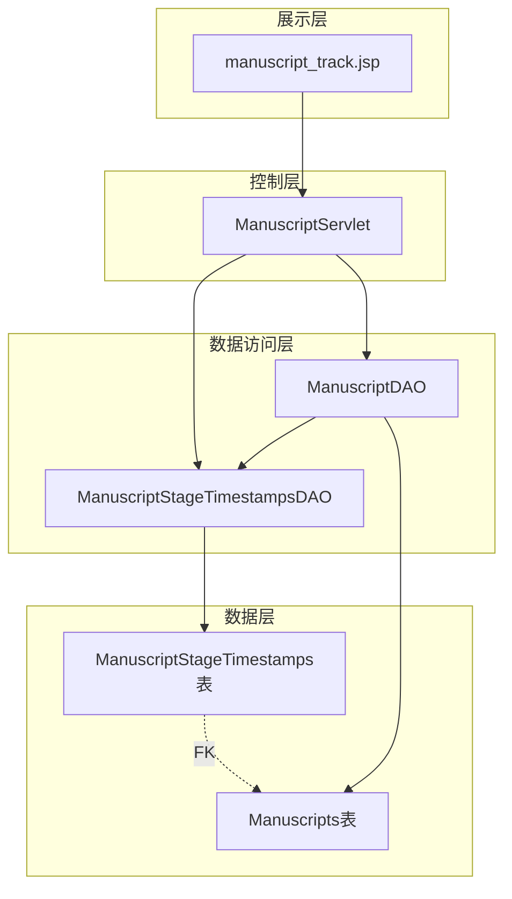

# Design Document: 稿件阶段时间追踪

## Overview

本设计为稿件管理系统新增阶段时间追踪功能。通过创建 `ManuscriptStageTimestamps` 数据表，记录每份稿件在各审稿阶段的完成时间，并在作者的"状态追踪"界面时间线上展示这些时间信息。

设计遵循现有系统架构模式：
- 数据层：SQL Server 表 + Java DAO
- 业务层：在状态变更时自动记录时间戳
- 展示层：JSP 页面读取并显示时间数据

## Architecture



## Components and Interfaces

### 1. 数据库表：ManuscriptStageTimestamps

```sql
CREATE TABLE dbo.ManuscriptStageTimestamps (
    ManuscriptId                    INT PRIMARY KEY,
    DraftCompletedAt                DATETIME2(0) NULL,
    SubmittedAt                     DATETIME2(0) NULL,
    FormalCheckCompletedAt          DATETIME2(0) NULL,
    DeskReviewInitialCompletedAt    DATETIME2(0) NULL,
    ToAssignCompletedAt             DATETIME2(0) NULL,
    WithEditorCompletedAt           DATETIME2(0) NULL,
    UnderReviewCompletedAt          DATETIME2(0) NULL,
    EditorRecommendationCompletedAt DATETIME2(0) NULL,
    FinalDecisionPendingCompletedAt DATETIME2(0) NULL,
    
    CONSTRAINT FK_MST_Manuscript 
        FOREIGN KEY(ManuscriptId) 
        REFERENCES dbo.Manuscripts(ManuscriptId)
);
```

状态与字段映射关系：

| 状态码 | 中文名称 | 对应字段 |
|--------|----------|----------|
| DRAFT | 草稿编辑中 | DraftCompletedAt |
| SUBMITTED | 已提交待处理 | SubmittedAt |
| FORMAL_CHECK | 形式审查中 | FormalCheckCompletedAt |
| DESK_REVIEW_INITIAL | 案头初筛 | DeskReviewInitialCompletedAt |
| TO_ASSIGN | 待分配编辑 | ToAssignCompletedAt |
| WITH_EDITOR | 编辑处理中 | WithEditorCompletedAt |
| UNDER_REVIEW | 外审进行中 | UnderReviewCompletedAt |
| EDITOR_RECOMMENDATION | 编辑推荐意见 | EditorRecommendationCompletedAt |
| FINAL_DECISION_PENDING | 待主编终审 | FinalDecisionPendingCompletedAt |

### 2. Model类：ManuscriptStageTimestamps

```java
package edu.bjfu.onlinesm.model;

public class ManuscriptStageTimestamps {
    private Integer manuscriptId;
    private LocalDateTime draftCompletedAt;
    private LocalDateTime submittedAt;
    private LocalDateTime formalCheckCompletedAt;
    private LocalDateTime deskReviewInitialCompletedAt;
    private LocalDateTime toAssignCompletedAt;
    private LocalDateTime withEditorCompletedAt;
    private LocalDateTime underReviewCompletedAt;
    private LocalDateTime editorRecommendationCompletedAt;
    private LocalDateTime finalDecisionPendingCompletedAt;
    
    // getters and setters
}
```

### 3. DAO类：ManuscriptStageTimestampsDAO

```java
package edu.bjfu.onlinesm.dao;

public class ManuscriptStageTimestampsDAO {
    
    // 根据稿件ID查询时间戳记录
    public ManuscriptStageTimestamps findByManuscriptId(int manuscriptId);
    
    // 检查记录是否存在
    public boolean exists(int manuscriptId);
    
    // 创建新记录（仅ManuscriptId，其他字段为NULL）
    public void create(int manuscriptId);
    
    // 更新指定阶段的完成时间
    public void updateStageCompletedAt(int manuscriptId, String fromStatus);
    
    // 确保记录存在并更新时间戳（组合方法）
    public void ensureAndUpdateStage(int manuscriptId, String fromStatus);
}
```

### 4. 状态变更集成点

在 `ManuscriptDAO` 的状态变更方法中调用时间戳记录：

```java
// 在 updateStatusWithHistory 方法中添加
manuscriptStageTimestampsDAO.ensureAndUpdateStage(manuscriptId, oldStatus);
```

需要集成的方法：
- `updateStatusWithHistory()` - 通用状态变更
- `assignEditorWithHistory()` - 分配编辑
- `changeDeskDecision()` - 更改案头决定
- `changeFinalDecision()` - 更改终审决定

## Data Models

### ManuscriptStageTimestamps 实体

| 字段 | 类型 | 说明 |
|------|------|------|
| manuscriptId | Integer | 稿件ID，主键，外键关联Manuscripts |
| draftCompletedAt | LocalDateTime | 草稿阶段完成时间 |
| submittedAt | LocalDateTime | 提交阶段完成时间 |
| formalCheckCompletedAt | LocalDateTime | 形式审查完成时间 |
| deskReviewInitialCompletedAt | LocalDateTime | 案头初筛完成时间 |
| toAssignCompletedAt | LocalDateTime | 待分配编辑完成时间 |
| withEditorCompletedAt | LocalDateTime | 编辑处理完成时间 |
| underReviewCompletedAt | LocalDateTime | 外审完成时间 |
| editorRecommendationCompletedAt | LocalDateTime | 编辑推荐完成时间 |
| finalDecisionPendingCompletedAt | LocalDateTime | 待终审完成时间 |

## Correctness Properties

*A property is a characteristic or behavior that should hold true across all valid executions of a system-essentially, a formal statement about what the system should do. Properties serve as the bridge between human-readable specifications and machine-verifiable correctness guarantees.*

### Property 1: 状态变更时间戳记录一致性

*For any* 稿件状态变更操作，当稿件从状态 S 变更到其他状态时，ManuscriptStageTimestamps 表中对应状态 S 的完成时间字段应被设置为非空值，且该值应接近当前系统时间。

**Validates: Requirements 2.1, 2.2, 2.3, 2.4, 2.5, 2.6, 2.7, 2.8, 2.9**

### Property 2: 时间戳显示格式正确性

*For any* 非空的阶段完成时间，在时间线界面上显示时应符合 "yyyy-MM-dd HH:mm" 格式，且显示的时间值与数据库存储值一致。

**Validates: Requirements 3.2, 3.4**

## Error Handling

### 数据库层错误处理

1. **外键约束违反**：当尝试为不存在的 ManuscriptId 创建时间戳记录时，数据库将抛出外键约束异常
   - 处理方式：在 DAO 层捕获 SQLException，记录日志并向上层抛出业务异常

2. **重复主键**：当尝试为已存在记录的 ManuscriptId 创建新记录时
   - 处理方式：使用 `exists()` 方法先检查，或使用 MERGE 语句

3. **连接失败**：数据库连接不可用
   - 处理方式：使用现有的 DbUtil 连接池机制，异常向上传播

### 业务层错误处理

1. **无效状态码**：传入的 fromStatus 不在预定义的状态列表中
   - 处理方式：静默忽略，不更新任何字段（向后兼容）

2. **记录不存在**：查询时间戳记录返回 null
   - 处理方式：在界面层判断，不显示时间信息

## Testing Strategy

### 单元测试

1. **DAO 层测试**
   - 测试 `findByManuscriptId()` 返回正确数据
   - 测试 `exists()` 正确判断记录存在性
   - 测试 `create()` 成功创建记录
   - 测试 `updateStageCompletedAt()` 正确更新对应字段

2. **集成测试**
   - 测试状态变更时时间戳自动记录
   - 测试界面正确显示时间数据

### 属性测试

使用 JUnit + jqwik 进行属性测试：

1. **Property 1 测试**：生成随机状态变更序列，验证每次变更后对应时间戳字段被正确设置
   - 最少 100 次迭代
   - Tag: **Feature: manuscript-stage-timestamps, Property 1: 状态变更时间戳记录一致性**

2. **Property 2 测试**：生成随机时间戳值，验证格式化输出符合预期格式
   - 最少 100 次迭代
   - Tag: **Feature: manuscript-stage-timestamps, Property 2: 时间戳显示格式正确性**
